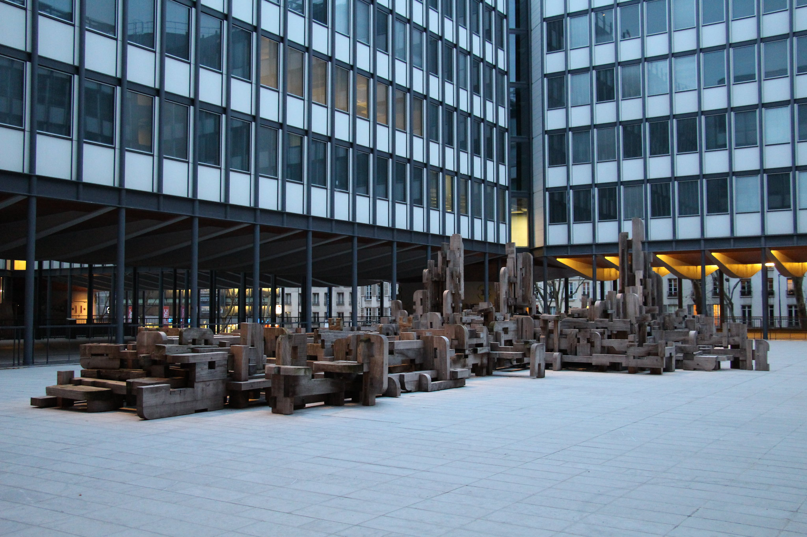

# International Joint Conference on Theoretical Computer Science – Frontier of Algorithmic Wisdom (IJTCS-FAW 2025)

## Overview

International Joint Conference on Theoretical Computer Science – Frontier of Algorithmic Wisdom (IJTCS-FAW 2025) will be held on Monday June 30 to Wednesday July 2, 2025, hosted by Sorbonne University, Paris, France. We aim to provide a platform for advancing theoretical computer science and promoting the exchange of knowledge and ideas. It is the 6th IJTCS and 19th FAW. 

IJTCS-FAW 2024 is calling for papers concerning any branch of theoretical computer science, together with focus tracks in Algorithm and Complexity, Algorithmic Game Theory, Automata Theory and Formal Languages, Blockchain, Computational Biology and Bioinformatics, Computational Geometry, Formal Methods and Verification, Graph Theory and Algorithms, Multi-agent Reinforcement Learning, Network Economics, Parallel and Distributed Algorithms, Quantum Computation, Theoretical Aspects of Artificial Intelligence, Theory of Machine Learning. 

## Schedule

|           |                 | Monday      | Tuesday    | Wednesday  | 
| --------- |:--------------- |:----------- | ---------- | ---------- | 
| morning   |                 | conference  | conference | conference | 
| afternoon |                 | conference  | conference | -          | 
| evening   | light reception |             | Banquet    |            | 

## Previous editions

- FAW started in 2007
- IJTCS started in 2020
- joint IJTCS-FAW started in 2021
- [2024](http://ijtcs2024.comp.polyu.edu.hk/program.html)

## Committees

- Conference Chair
  - [John E. Hopcroft](https://en.wikipedia.org/wiki/John_Hopcroft) 
- General Chair
  - [Li Hao](https://www.lri.fr/~li/English.html) 
- Program Committee Chair 
  - [Christoph Dürr](https://www.lip6.fr/Christoph.Durr)  
  - [Minming Li](https://www.cs.cityu.edu.hk/~minmli/)  
  - [Xiaoming Sun](http://english.ict.cas.cn/people/scien/bln/202303/t20230315_328241.html)  
- Track A: the 19th Conference on Frontiers of Algorithmic Wisdom
  - [Thomas Erlebach](https://www.durham.ac.uk/staff/thomas-erlebach/) 
- Track on game theory, algorithmic game theory, machine learning, electronic commerce
  - [Vianney Perchet](https://www.ensae.fr/faculty/670-vianney-perchet)
  - [Johanne Cohen](https://www.lri.fr/~jcohen/fr/) 
  - [Yukun Cheng](http://busi.jiangnan.edu.cn/english/info/1892/10794.htm) 
- Track on block-chain, distributed computing
  - [Maria Potob-Butucaru](https://lip6.fr/Maria.Potop-Butucaru)  
- local organisation
  - [Evripidis Bampis](https://www.lip6.fr/Evripidis.Bampis)
  - [Vincent Chau](https://cse.seu.edu.cn/49354/list.htm)
  - [Christoph Dürr](https://www.lip6.fr/Christoph.Durr) 

## Important dates

- Submission deadline: 29 January 2025 
- Notification: 20 March 2025
- Full version: 20 April 2025
- Conference dates: Monday June 30 (noon) to Wednesday July 2 (noon)

- [2025](2025)
- [2024](http://ijtcs2024.comp.polyu.edu.hk/)

