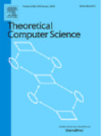

<link rel="shortcut icon" type="image/x-icon" href="favicon.ico?">

©️ photo by [Fred Romero](https://www.flickr.com/people/129231073@N06/)

## Practical informations

- [schedule](schedule)
- [hotel and restaurants](practical)

## Overview

International Joint Conference on Theoretical Computer Science – Frontier of Algorithmic Wisdom (IJTCS-FAW 2025) will be held on Monday June 30 to Wednesday July 2, 2025, hosted by Sorbonne University, Paris, France. We aim to provide a platform for advancing theoretical computer science and promoting the exchange of knowledge and ideas. It is the 6th IJTCS and 19th FAW. 

IJTCS-FAW 2025 is calling for papers concerning any branch of theoretical computer science, together with focus tracks in Algorithm and Complexity, Algorithmic Game Theory, Automata Theory and Formal Languages, Blockchain, Computational Biology and Bioinformatics, Computational Geometry, Formal Methods and Verification, Graph Theory and Algorithms, Multi-agent Reinforcement Learning, Network Economics, Parallel and Distributed Algorithms, Quantum Computation, Theoretical Aspects of Artificial Intelligence, Theory of Machine Learning. 

## Important dates

- Submission deadline: ~~29 January 2025~~ extended to 16 February 2025 (anywhere on earth)
- Notification: 20 March 2025
- Full version: 20 April 2025
- Conference dates: Monday June 30 to Wednesday July 2 (noon)

## Submission

Authors are invited to submit an extended abstract of no more than 12 pages, excluding references and the front page(s) (authors, affiliation, keywords, abstract, ...), presenting original research on the theory of computer science. Technical details necessary for a proper scientific evaluation of a submission must be included in the 12-page submission or in a clearly labelled appendix, to be consulted at the discretion of program committee members. Authors are encouraged to also make full versions of their submissions freely accessible in an online repository such as ArXiv.

Submissions must be formatted in the [LNCS style](https://www.springer.com/gp/computer-science/lncs/conference-proceedings-guidelines). All submission must be submitted via EasyChair using the following link:

[Submission link](https://easychair.org/conferences/?conf=ijtcsfaw2025)

The proceedings of the conference will be published by Springer-Verlag in the Lecture Notes in Computer Science (LNCS) series, and will be available for distribution at the conference. The use of pdflatex and the LNCS style is mandatory: papers that deviate significantly from the required format may be rejected without consideration of merit. No prior publication and no simultaneous submission to other conferences are allowed.

Papers will be reviewed according to the following tracks that includes 

#### Track A: the 19th Conference on Frontiers of Algorithmic Wisdom

This track focuses on current trends of research on algorithms, discrete structures, and their applications. Typical but not exclusive topics of interest are:
- Algorithms and data structures
- Approximation algorithms and online algorithms
- Parallel and Distributed Algorithms
- Bioinformatics
- Combinatorial optimization
- Combinatorics and discrete structures related to algorithms and complexity
- Complexity theory
- Computational Geometry
- Graph algorithms and theory
- Internet algorithms and protocols
- Large graph algorithms and social network analysis
- Learning based algorithms
- Optimization algorithms in economic and operations research
- Parameterized algorithms
- Automata Theory and Formal Languages
- Formal Methods and Verification

#### Track B: Block-chain, distributed computing, multi-agents

This track focuses on original studies on blockchains, cryptocurrencies and distributed financial markets. Papers may report the most recent developments on the theory, design, implementation, and analysis of blockchain infrastructure, economics, security, performance, interoperability, and other topics related to blockchains and distributed ledgers at large. Typical but not exclusive topics of interest are:
- Consensus protocols and scalability
- Smart contracts: design, analysis, security, attacks
- Distributed storage
- Automated market makers and exchanges
- Mechanism design for blockchains
- Equilibrium and game theoretic analysis for blockchains
- Transaction fees and tokenomics
- Network formation games, network structure and performance studies
- Multi-agent systems
- Mean field games, stochastic games, evolutionary games in blockchains
- Financial markets
- Information elicitation and oracles
- Token bridges and cross-chain solutions
- Security on blockchains: threat models, attacks, and solutions
- Privacy and anonymity, privacy-oriented computation
- Quantum-resilient cryptography and its applications in blockchains and financial markets

#### Track C: Game theory, algorithmic game theory, machine learning, electronic commerce

Typical but not exclusive topics of interest are:
- Algorithmic Mechanism Design
- Auction Design and Analysis
- Complexity Classes in Game Theory
- Computational Aspects of Equilibria
- Computational Aspects of Fixed-Point Theorems
- Computational Social Choice
- Computing with Incentives
- Cost-Sharing Algorithms and Analysis
- Decision Theory, and Pricing
- Economic Aspects of Distributed Computing
- Efficiency of Equilibria and Price of Anarchy
- Graph-Theoretic Aspects of Social Networks
- Internet Economics and Computational Advertising
- Repeated Games and Convergence of Dynamics
- Reputation, Recommendation, and Trust Systems
- Solution Concepts in Game Theory
- Theoretical Aspects of Artificial Intelligence
- Theory of Machine Learning. 

## Committees

- Conference Chair
  - [John E. Hopcroft](https://en.wikipedia.org/wiki/John_Hopcroft), Cornell University, USA
  - [Huimin Lin](https://people.ucas.ac.cn/~lhm?language=en), University of Chinese Academy of Sciences, China
- General Chair
  - [Hao Li](https://www.lri.fr/~li/English.html), LISN University Paris Saclay, France
- Program Committee Chairs 
  - [Christoph Dürr](https://www.lip6.fr/Christoph.Durr), Sorbonne University, France
  - [Minming Li](https://www.cs.cityu.edu.hk/~minmli/), City University of Hong Kong, China
  - [Pinyan Lu](http://pinyanlu.com), Shanghai University of Finance and Economics, China
- Track A: the 19th Conference on Frontiers of Algorithmic Wisdom
  - [Evripidis Bampis](https://www.lip6.fr/Evripidis.Bampis), Sorbonne University, France
  - [Cristina Bazgan](https://www.lamsade.dauphine.fr/~bazgan/), University Paris Dauphine, France
  - [Cédric Bentz](https://cedric.cnam.fr/~bentzc/Bentz.php), Conservatoire national des arts et métiers, France
  - [Vincent Chau](https://gchauv.github.io), Université Évry Paris-Saclay
  - [Christoph Dürr](https://www.lip6.fr/Christoph.Durr), Sorbonne University, France
  - [Thomas Erlebach](https://www.durham.ac.uk/staff/thomas-erlebach/) (co-chair), Durham University, UK
  - [Qilong Feng](https://faculty.csu.edu.cn/fengqilong/en/index.htm), Central South University, China
  - [Hao Li](https://www.lri.fr/~li/English.html), LISN University Paris Saclay, France
  - [Minming Li](https://www.cs.cityu.edu.hk/~minmli/), City University of Hong Kong, China
  - [Ya-Chun Liang](https://researchoutput.ncku.edu.tw/en/persons/ya-chun-liang),  National Cheng Kung University, Taiwan
  - [Hsiang-Hsuan Liu](https://www.uu.nl/staff/HHLiu/CV), Utrecht University, Netherlands
  - [Kelin Luo](https://engineering.buffalo.edu/computer-science-engineering/people/faculty-directory/full-time.host.html/content/shared/engineering/computer-science-engineering/profiles/faculty/teaching/luo-kelin.detail.html), University at Buffalo, USA
  - [Pan Peng](http://staff.ustc.edu.cn/~ppeng/), University of Science and Technology of China
  - [David Saulpic](http://www.normalesup.org/~saulpic/), Université Paris Cité, France
  - [Sylvain Sené](https://pageperso.lis-lab.fr/~sylvain.sene/), Aix-Marseille University, France
  - [Jialin Zhang](http://english.ict.cas.cn/people/scien/bln/202303/t20230315_328233.html) (co-chair), Institute of Computing Technology,  Chinese Academy of Science, China
  - [Ruilong Zhang](https://ruilong-zhang.github.io), Technische Universität München, Germany
- Track B: on block-chain, distributed computing, multi-agents
  - [Gewu Bu](https://loop.frontiersin.org/people/1316129/overview), University Clermont Auvergne, France
  - [Ralf Klasing](https://www.labri.fr/perso/klasing/) (co-chair), University of Bordeaux, France
  - [Jiasun Li](https://www.gmu.edu/profiles/jli29) (co-chair), George Mason University, USA
  - [Ye Wang](https://www.ye.wang), Macau University, China
- Track C: on game theory, algorithmic game theory, machine learning, electronic commerce
  - [Xiaohui Bei](https://dr.ntu.edu.sg/cris/rp/rp00196), Nanyang Technological University, Singapore
  - [Yurong Chen](https://ruyc.github.io), Inria Paris, France
  - [Yukun Cheng](http://busi.jiangnan.edu.cn/english/info/1892/10794.htm) (co-chair), Jiangnan University, China
  - [Johanne Cohen](https://www.lri.fr/~jcohen/fr/) (co-chair), University Paris Saclay, France
  - [Yiding Feng](https://www.ydfeng.us), Hong Kong University of Science and Technology, China
  - [Bo Li](https://www4.comp.polyu.edu.hk/~bo2li/), The Hong Kong Polytechnic University, China
  - [Vianney Perchet](https://www.ensae.fr/faculty/670-vianney-perchet) (co-chair), ENSAE Paris, France
  - [Qi Qi](https://gsai.ruc.edu.cn/english/qiqi), Renmin University of China, China
  - [Warut Suksompong](https://www.comp.nus.edu.sg/~warut/), National University of Singapore, Singapore
  - [Changjun Wang](https://cjwangw.weebly.com), Academy of Mathematics and Systems Science, Chinese Academy of Sciences, China
  - [Zihe Wang](https://gsai.ruc.edu.cn/english/wangzihe), Renmin University of China, China
  - [Xiaowei Wu](https://sites.google.com/site/wxw0711/), University of Macau, China
  - [Fang-Yi Yu](https://cs.gmu.edu/~fangyiyu/), George Mason University, USA
  - [Jie Zhang](https://researchportal.bath.ac.uk/en/persons/jie-zhang), University of Bath, UK
  - [Jinshan Zhang](https://person.zju.edu.cn/en/zhangjinshan), Zhejiang University, China
  - [Dengji Zhao](http://dengji-zhao.net), ShanghaiTech University, China
- Local Organisation (ijtcs-faw@listes.lip6.fr)
  - [Evripidis Bampis](https://www.lip6.fr/Evripidis.Bampis)
  - [Vincent Chau](https://gchauv.github.io)
  - [Christoph Dürr](https://www.lip6.fr/Christoph.Durr)
- Advisor Committee
  - [Wen Gao](https://cfcs.pku.edu.cn/english/people/directors/wengao/index.htm), Peking University
  - [Hong Mei](http://faculty.pku.edu.cn/meih/en/zdylm/43525/list/index.htm) CCF President
  - [Pingwen Zhang](https://en.whu.edu.cn/info/1345/7111.htm), CSIAM President and Wuhan University
- Steering Committee
  - [Xiaotie Deng](https://cfcs.pku.edu.cn/english/people/faculty/xiaotiedeng/index.htm), Peking University
  - [Jian Li](https://people.iiis.tsinghua.edu.cn/~jianli/), Tsinghua University
  - [Pinyan Lu](http://pinyanlu.com), Shanghai University of Finance and Economics, China
  - [Jianwei Huang](https://jianwei.cuhk.edu.cn/), Chinese University of Hong Kong Shenzhen
  - [Lijun Zhang](https://tis.ios.ac.cn/people/lijun-zhang/), Chinese Academy of Sciences

## Special Issue

After the conference, selected papers will be invited to special issues in: Theoretical Computer Science, Journal of Combinatorial Optimization, Theory of Computing Systems, and Blockchain.

## Registration

Registration opened May 15. Register [here](https://framaforms.org/registration-for-ijtcs-faw-1747296497).

We are experiencing some delay in installing a payment system, and apologize. Therefore the deadline for early registration will be announced once the payment system is running.

| category                            | early | late  |
| ----------------------------------- | ----- | ----- |
| normal                              | 420 € | 500 € |
| member of China Computer Federation | 336 € | 400 € |
| member of Sorbonne University       | 336 € | 400 € |
| student                             | 350 € | 420 € |
| student member of CCF               | 280 € | 336 € | 

## Keynotes

- [Gabrielle Demange](https://en.wikipedia.org/wiki/Gabrielle_Demange)
- [Xiaoming Sun](http://english.ict.cas.cn/people/scien/bln/202303/t20230315_328241.html)  
- [Shanghua Teng](https://viterbi-web.usc.edu/~shanghua/)

## Previous editions

- FAW started in 2007
- IJTCS started in 2020
- joint IJTCS-FAW started in 2021

- [IJTCS-FAW-2024](http://ijtcs2024.comp.polyu.edu.hk/program.html): Hong Kong, China
- [IJTCS-FAW-2023](https://conferences.cis.um.edu.mo/ijtcs2023/): Macao, China
- [IJTCS-FAW-2022](https://conference.cs.cityu.edu.hk/ijtcs2022/): Hong Kong, China
- [IJTCS-FAW-2021](https://econcs.pku.edu.cn/ijtcs2021/index.htm): Beijing, China
- [IJTCS-2020](https://econcs.pku.edu.cn/ijtcs2020/IJTCS2020.html): Beijing, China
- FAW-2020: Haikou, China
- [FAW-2019](http://people.iiis.tsinghua.edu.cn/~jianli/FAW2019/FAW2019.html): Sanya, China
- FAW-2018: Guangzhou, China
- [FAW 2017](https://tcsuestc.com/FAW2017/): Chengdu, China
- FAW 2016: Qingdao, China
- FAW 2015: Guilin, China
- FAW 2014: Zhangjiajie, China
- FAW 2013: Dalian, China
- FAW 2012: Beijing, China
- FAW 2011: Jinhua, China
- FAW 2010: Wuhan, China
- FAW 2009: Hefei, China
- FAW 2008: Changsha, China
- FAW 2007: Lanzhou, China

## Financial support

We would like to thank the following organizations for supporting the conference.

 

## Supporting Organization

